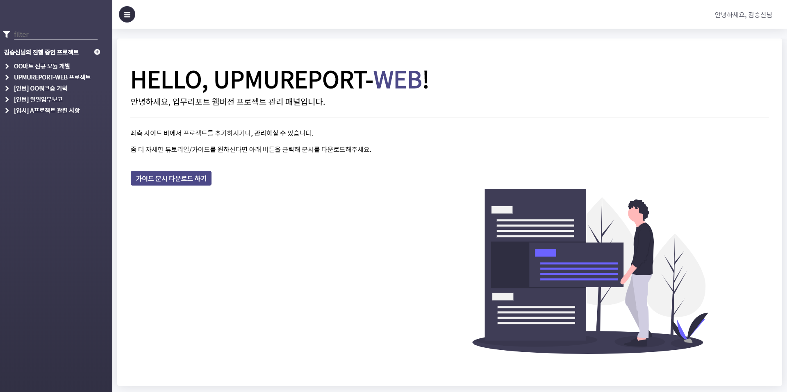
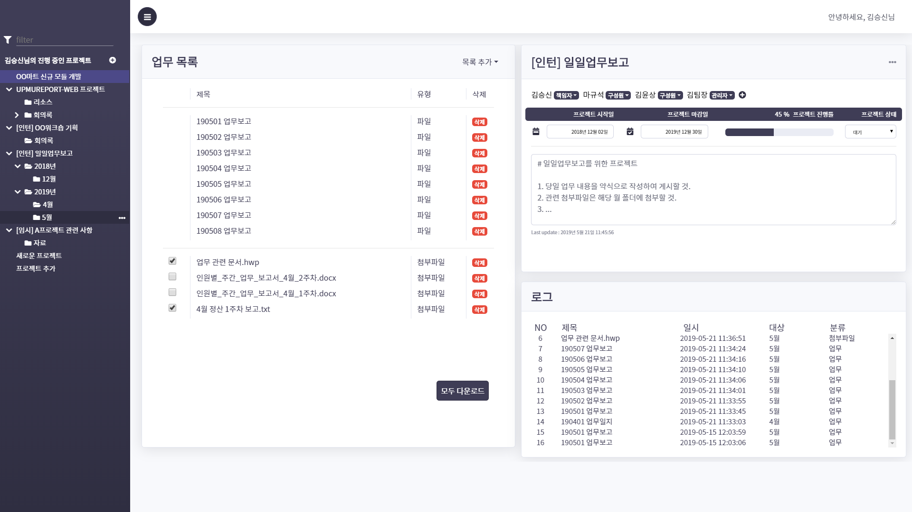

# 📊 UPMUREPORT-WEB 

## ICT 인턴 프로젝트
사내 프로젝트와 사원을 관리하는 웹 페이지입니다.

- 사원들의 입사일, 진급, 퇴사일을 등록하고 관리 할 수 있습니다.
- 프로젝트를 등록하고 진행 사원을 등록하고 진행도를 확인 할 수 있습니다. 
- 프로젝트 진행 시 생성되는 파일을 업로드, 다운로드 할 수 있습니다.
- 프로젝트 생성, 변경등 진행 사항이 있을 때 로그를 남겨 프로젝트 진행 사항을 알 수 있습니다.

## 화면 구성

<table>
    <tr>
        <td colspan="2">
            
        </td>
    </tr>
	<tr>
		<td>
			
		</td>
		<td>
			
		</td>
	</tr>
</table>

## 구현 사항

### Back end

#### spring boot

1. spring boot 프레임워크를 사용하여 REST API 구현
2. JPA를 사용하여 DB table 객체화, 영속성 관리
3. spring security를 사용하여 보안 강화
4. Swagger를 사용하여 api 문서 자동화
5. Global exception handler를 사용하여 exception custom 기능 구현
6. file upload, download 기능 구현
7. Maven을 사용하여 빌드 후 사내 서버에 배포

### Front end

#### React.js

1. Redux를 사용하여 컴포넌트의 함수, 데이터 공유
2. API Server에 비동기 요청
3. file upload, download 기능 구현 